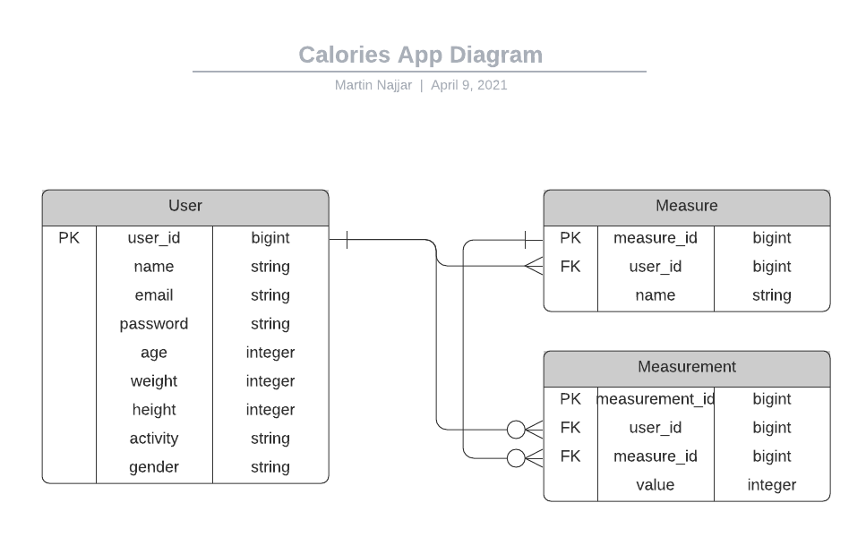

<h1 align='center'>Calories Backend - Rails API</h1>

> Backend repository that servers API for the Calories App. You can find the frontend repo by visiting this link https://github.com/martinnajjar12/calories-frontend



<p><small>Database Diagram</small></p><br /><br />

## Built With

- Ruby 2.7.1
- Rails 6.1.3
- Devise Auth Token
- Rack CORS
- RSpec
- ShouldaMatchers
- Active Model Serializer

## Live Demo

The app is published on https://caloriesapi.heroku.com/

## Getting Started

To get a local copy up and running follow these simple example steps.

### Prerequisites

- Ruby 2.7.1
- Rails 6.1.3
- Code Editor

### Setup

<p>Clone this repo either by typing `git clone https://github.com/martinnajjar12/calories-backend` (You must have git installed on your local machine in this case) or download a zip version of the code from GitHub.</p>

<p>Install the gems with:</p>

```
  bundle install
```

### Usage

Type `rails s` to start the server on port 3000

### Run tests

To test the application please run this command:

```
  rspec
```

## Author: Martin Najjar

- Github: [@martinnajjar12](https://github.com/martinnajjar12)
- Twitter: [@martin_najjar](https://twitter.com/martin_najjar)
- LinkedIn: [Martin Najjar](https://www.linkedin.com/in/martinnajjar12/)

## 🤝 Contributing

Contributions, issues and feature requests are welcome!

Feel free to check the [issues page](https://github.com/martinnajjar12/calories-backend/issues).

## Show your support

Give a ⭐️ if you like this project!

## Acknowledgments

- [Microverse](https://microverse.org)
- Lucidchart (for creating the database diagram)

### 📝 License

This project is [MIT](https://github.com/martinnajjar12/calories-backend/blob/development/LICENSE) licensed.
